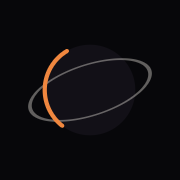
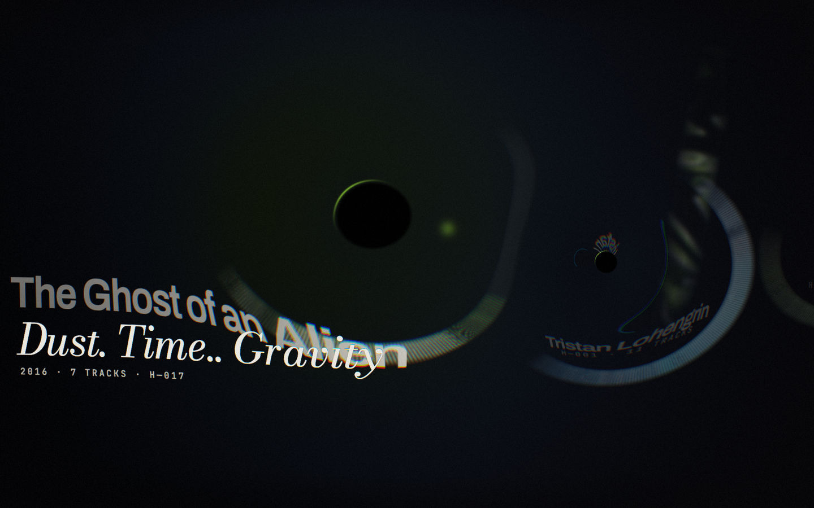
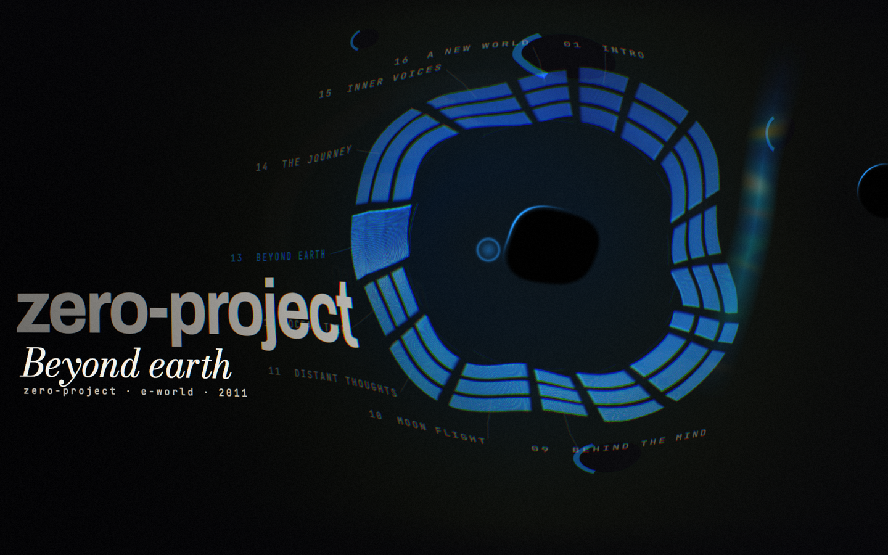
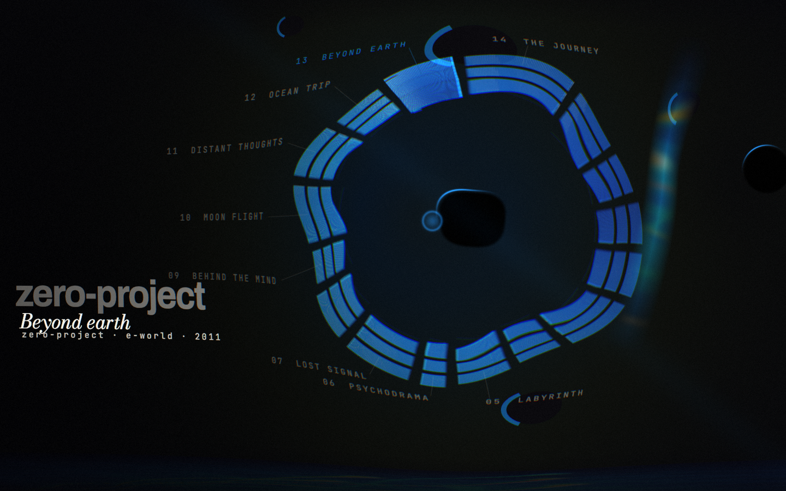

<h1 align="center">
  <br>
  
  <br>
  Horizonte
  <br>
</h1>

<h4 align="center">A music player where the music has mass, and mass bends space.</h4>

<p align="center">
  
  
  
  
  
  
  
</p>

<p align="center">
  <a href="#-features">Features</a> •
  <a href="#-the-field-engine">Field Engine</a> •
  <a href="#-the-sensory-signature">Sensory Signature</a> •
  <a href="#-tech-stack">Tech Stack</a> •
  <a href="#ℹ%EF%B8%8F-how-to-run-the-application">How To Run</a> •
  <a href="#-license">License</a>
</p>

<p align="center">
  Not a 3D scene with a UI on top — a single full-screen fragment shader that bends the typography and the album art with the same gravitational field. Every album carries its own physics, measured from its own audio.
</p>

<p align="center">
  🔗 <strong>Live demo:</strong> <a href="https://horizonte.marianacastro.dev">horizonte.marianacastro.dev</a>
</p>

<p align="center">
  
</p>

<br/>

## 🌌 Features

|                              |                                                                                                                                                                       |
| ---------------------------- | --------------------------------------------------------------------------------------------------------------------------------------------------------------------- |
| **🌀 Gravitational Lens**     | One full-screen fragment shader bends two 2D canvas planes. The monumental typography, the album art and the dust are all deformed by the same field — nothing is drawn "on top". |
| **🖱️ Cursor With Mass**       | The pointer is a body in the field, with accumulated velocity and inertia leaving a wake. No CSS hover is involved anywhere in the world layer.                        |
| **🔭 Scales, Not Screens**    | Collection → album → track is one continuous interpolation of anchor, radius, type size and mass — never a route change or a mounted/unmounted view.                   |
| **💥 Collapse & Fusion**      | Play runs a 2.25s collapse with a 180ms exposure valley and a jet; skipping runs a 1.6s fusion where the incoming body spirals in and emits a wave across the viewport. |
| **🎛️ Instruments Layer**      | Controls live in a separate DOM layer that is mono, never deformed, always clickable, and auto-fades to 32% after 2.6s of stillness. No action depends on a keyboard shortcut. |
| **🔊 Real Audio Analysis**    | `HTMLAudioElement` → `AnalyserNode` → three bands feeding the field, with a hard ±15% ceiling on curvature so the typography accents the music instead of dancing to it. |
| **🧬 Per-Album Physics**      | Each album's loudness, dynamics, brightness and length are measured offline and become the constants of its world — playback only perturbs them.                      |
| **📀 Bring Your Own Record**  | Drop your own files and the same DSP runs **in the browser**, in a worker, producing the same `AlbumSignature` the curated catalogue gets. Nothing is uploaded — no backend, no CDN, no API. |
| **⚖️ Licensed Curation**      | Fourteen real albums — twelve CC BY 4.0 and two CC BY-SA 4.0 — each verified at the source by a pipeline that aborts on any license mismatch, with attribution surfaced in the UI.                 |
| **♿ Accessible By Design**   | Real `button` / `ul` / `li`, `aria-current`, `aria-pressed`, `role="progressbar"`, `aria-live`, visible keyboard focus, and a full `prefers-reduced-motion` path.       |

<br/>

## 🖼️ Screenshots

<table>
  <tr>
    <td align="center" width="50%"><strong>Album — sectorized ring</strong></td>
    <td align="center" width="50%"><strong>Track in progress</strong></td>
  </tr>
  <tr>
    <td valign="top"></td>
    <td valign="top"></td>
  </tr>
</table>

<br/>

## 🛠️ Tech Stack

<p>
  
  
  
  
  
  
  
  
  
</p>

| Category          | Technologies                                                              |
| ----------------- | ------------------------------------------------------------------------- |
| **Framework**     | Next.js 16 (App Router), React 19                                         |
| **Language**      | TypeScript 5                                                              |
| **Rendering**     | three.js 0.185 (`RawShaderMaterial`, full-screen triangle), custom GLSL    |
| **Composition**   | Canvas 2D — two offscreen planes uploaded as `CanvasTexture` every frame   |
| **Audio**         | Web Audio API (`AnalyserNode`, FFT 1024) over `HTMLAudioElement`           |
| **Styling**       | Tailwind CSS v4 (instruments layer only — the world is canvas)             |
| **Typography**    | Archivo, Bodoni Moda, JetBrains Mono — self-hosted via `next/font`         |
| **Media Storage** | Vercel Blob (public CDN, HTTP Range, immutable cache)                      |
| **Offline Tools** | Python 3 + NumPy + Pillow (curation, audio analysis), `afconvert`          |
| **In-Browser DSP**| Web Worker, `OfflineAudioContext`, hand-written real FFT (no dependencies) |
| **Tooling**       | ESLint, TypeScript strict mode                                            |

<br/>

## 📝 Project Description

Horizonte is a spatial music experience built on one idea: **music has mass, and mass bends space.**

The whole composition — monumental typography, album art, dust, void — is drawn into two offscreen 2D canvases and deformed by a gravitational-lens fragment shader. There is no 3D scene and no UI floating above a background: the same field bends the artist's name and the album art at once. The front plane is sampled with **34% of the displacement**, and that parallax is what makes the track title pass *in front of* the body while everything else passes behind it.

Navigation is a change of physical scale rather than a change of screen. Collection, album and track are the same world at different anchors, radii, type sizes and mass values, interpolated continuously — nothing mounts or unmounts. A separate **instruments layer** (mono, 10.5px, never deformed) guarantees every fundamental action stays clickable and legible, including at the peak of the collapse.

**Additional features:**

- **The field engine:** The flagship piece. See the [dedicated section](#-the-field-engine) below — a single draw call per frame, two texture uploads, and a state machine that treats collapse and fusion as physical events rather than transitions.
- **Sensory signatures:** Each album's audio is analysed once, offline, into loudness / dynamics / brightness / duration descriptors that become that album's field constants — see the [dedicated section](#-the-sensory-signature).
- **Decoupled audio pipeline:** `audio source → playback → analysis → visual state → Horizonte`. The scene never touches an `<audio>` element or an `AnalyserNode`; it reads a plain `VisualAudioState` (energy, three bands, accent, spectral flux, spectrum, progress). `AudioSource` is a discriminated union and `Playback` is an interface, so another provider can be added without touching the shader, the composition or the state machine.
- **Verified curation:** Fourteen albums from real artists — twelve **CC BY 4.0** and two **CC BY-SA 4.0**, whose share-alike obligation is documented per album — each verified at the source before download. The pipeline aborts if the declared licence doesn't match, if the download disappears, or if durations don't line up with the catalogue metadata. Six candidates were rejected on inspection — two declared contradictory licences on the same page, two were CC BY-**NC-ND** (no transcoding, no commercial use), one was a paid pack under a proprietary licence, one had no CC licence at all. Provenance, attribution, cover licensing and the exact modifications applied to each work are documented in [`CURADORIA.md`](CURADORIA.md).
- **Cover unification:** Real covers arrive with wildly different exposure and palette. Each one is desaturated ~8%, overprinted with the album ink, given a shared grain, and exposure-equalised so a dark ambient sleeve still reads in the `lighter`-composited ring. The two inks are extracted from the artwork and forced into `oklch(L .50–.62, C .13–.18)` — a narrow band that keeps the collection coherent.
- **Bring your own record:** The same analysis that runs offline for the curated catalogue also runs **client-side**, in a Web Worker, over files the listener drops in. `analyze-audio.py` was ported to TypeScript and verified against it: fed identical PCM, the two produce **byte-identical envelopes on all ten albums measured at the time**. End to end from the real `.m4a` files, the derived field constants land within **0.55% of each constant's range**. Files never leave the device — no upload, no backend, no external API. The full architecture, the parity measurements and the limitations are in [`docs/ingestao-local.md`](docs/ingestao-local.md).
- **Media on a CDN:** Audio and covers live in Vercel Blob under deterministic pathnames that mirror the catalogue (`/music/<album>/<track>.m4a`), served with HTTP Range (for seeking), permissive CORS (so the analyser isn't silenced and covers don't taint the canvas) and a one-year immutable cache. URL resolution is centralised in a single module; no absolute URL is hardcoded in a component.
- **Reduced motion:** With `prefers-reduced-motion`, curvature drops to 25%, radial blur and cursor parallax are disabled, and the collapse and fusion are reduced to 300ms fades — **the state changes remain**, so nothing becomes unreachable.
- **Responsive compositions:** Desktop, tablet (rails collapse into a single column, ring labels reduced to the selected track) and mobile (one body per screen, drag becomes pagination, 48px touch targets).

<br/>

## 🌀 The field engine

Everything the user sees is produced by **one draw call and two texture uploads per frame**:

```
step(dt) → drawBack() → drawFront() → render() → updateInstruments()
              │              │            │
      back plane        front plane    fragment shader
   (halo, ring, dust,   (title, sub,   (three masses + wave →
    typography, art      art fragment)  UV displacement, chromatic
    band, scrims)                       dispersion, radial blur,
                                        core, rim, jet, grain)
```

**Three masses bend the UVs.** The focused body, a secondary body (the neighbour in the collection, or the incoming album during a fusion) and the cursor each contribute a radial pull plus a tangential component. Sampling is chromatically dispersed (R/G/B at slightly different offsets) and radially blurred along the displacement.

**The front plane at 34%.** Both planes are sampled with the same offset field, but the front one at roughly a third of it. That difference in parallax is the entire depth illusion — no z-buffer, no camera.

**The collapse is a sequence, not a transition.** Pressing play runs 2.25s of scripted physics: mass ramps from 0.055 to 0.36 while exposure falls to a **180ms valley at 3%**, then the field relaxes as a jet fires along a fixed diagonal and the art band rises from the bottom edge.

**The fusion is the signature interaction.** Skipping to another track spirals the incoming body in from radius 1.5 over 0.9s while both artworks coexist as crossed arcs — then emits a wave that crosses the viewport, deforming the typography as it passes, and the audio switches on exactly that beat.

**Performance is budgeted.** DPR is capped at 1.3, the composition canvas at 1760px, ring buffers are baked once per album (and re-baked only when the selection changes), and the progress arc is only recomposited when it would actually move a pixel. If sustained frame rate drops below 52fps *while the tab is visible*, the composition canvas steps down to 1440px.

<br/>

## 🧬 The sensory signature

Reacting to live audio is the easy half. The harder question is: **why should two albums feel different when nothing is playing?**

So the audio is analysed **once, offline** ([`scripts/analyze-audio.py`](scripts/analyze-audio.py)), and what a record *is* becomes constant:

| Measured        | Becomes                                                          |
| --------------- | ---------------------------------------------------------------- |
| **Loudness**    | Type weight (505–780) and horizon scale — heavy records sit heavier |
| **Dynamics**    | How much live audio is allowed to perturb the field at all       |
| **Brightness**  | Ring flattening and rim hardness — bright records cut sharper    |
| **Duration**    | Camera inertia across the collection                             |
| **Track spans** | Real proportional widths of each sector in the ring              |

Two determinism guarantees hold the design together: every descriptor is normalised against **fixed absolute anchors** rather than against the other albums, so adding a record never changes anyone else's signature; and the fallback ink for achromatic covers is derived from **that album's own spectral balance**, never from its position in the list.

The result is the split the whole project rests on: **identity is measured and constant, reaction is live and bounded.** Playback perturbs the constants by at most ±15% — bass nudges mass, dynamics tension the field's spin, treble interferes with light through chromatic dispersion. Never an equaliser, never bars, never a sphere pulsing on the beat.

The full mapping, with the calibrated numbers and the seven albums compared, is in [`docs/mapa-sensorial.md`](docs/mapa-sensorial.md).

The signature has **two producers and one contract**: `analyze-audio.py` measures the curated catalogue once, at curation time; `src/components/horizonte/ingest/` measures a listener's own record in the browser, during the session. Past `AlbumSignature`, the engine never asks where a record came from.

<br/>

## 🛠️ Engineering challenges

The hardest part was keeping the audio **physical rather than decorative**. It's trivial to make something pulse on the beat and it always looks cheap; the discipline was capping every audio-driven value at ±15% of its base and pushing the real differentiation offline into measured constants.

Two failures were worth the trouble of catching. Migrating media to a CDN silently breaks `getImageData` — a cross-origin cover taints the canvas, and the cover exposure equalisation (which is what makes dark sleeves visible in the ring) throws `SecurityError` instead of degrading. I proved the behaviour against a local CORS-enabled origin before the migration rather than after. The second: a single negative frame delta was enough to drive the exposure lerp to `-Infinity` and then `NaN`, permanently blacking out the world — one clamp on `dt`, found only by driving the loop manually.

The curation pipeline also had to be genuinely defensive. It verifies the licence at the source on every run and refuses to proceed on a mismatch, because the tempting failure mode is to relax the check to reach a target number of albums.

<br/>

## ℹ️ How to run the application?

> Clone the repository:

```bash
git clone https://github.com/maricastroc/horizonte
```

> Install the dependencies:

```bash
npm install
```

> Rename `.env.example` to `.env.local` and fill it in.

The only variable needed to run the app is `NEXT_PUBLIC_MEDIA_BASE_URL`, pointing at the public CDN base that serves the catalogue. Media files are **not** versioned in Git, so a fresh clone has no audio until you either point at a CDN or rebuild the assets locally (see below).

> Start the service:

```bash
npm run dev
```

> Run the tests:

```bash
npm test
```

The parity tests between the in-browser analysis and the offline pipeline need the
WAV cache that `analyze-audio.py` leaves in `.cache/analysis`; without it they skip
themselves. In development, `/parity` runs the same comparison in the browser.

> Type-check and lint:

```bash
npm run typecheck
npm run lint
```

> ⏩ Access [http://localhost:3000](http://localhost:3000) to view the application.

### Rebuilding the media pipeline

Requires Python 3 with NumPy and Pillow, plus `afconvert` (bundled with macOS).

```bash
python3 scripts/fetch-curation.py    # verify licences, fetch, transcode, extract inks
python3 scripts/analyze-audio.py     # measure the sensory signature of each album
npm run media:upload                 # publish public/music to Vercel Blob
```

`fetch-curation.py` can rebuild the albums whose sources allow automated download. Albums distributed only through a manual flow are staged from `.cache/manual/<album>/` and reported as pending instead of being silently skipped. `media:upload` is incremental and verifies Range, CORS and cache headers before finishing.

<br/>

## 📄 License

Released under the [MIT License](LICENSE). You're free to use, study, fork and build on this code — **as long as the original copyright and license notice are kept**. Reuse it and learn from it; don't strip the attribution and present it as your own.

The **music is not covered by this licence.** Every album in the curation is licensed under [CC BY 4.0](https://creativecommons.org/licenses/by/4.0/) by its own artist, and each one requires attribution on its own terms — see [`CURADORIA.md`](CURADORIA.md) for provenance, licences and the required credit for each work.

© 2025–2026 Mariana Castro

<br/>

<div align="center">

⭐ If you like this project, give it a star on GitHub!

</div>
